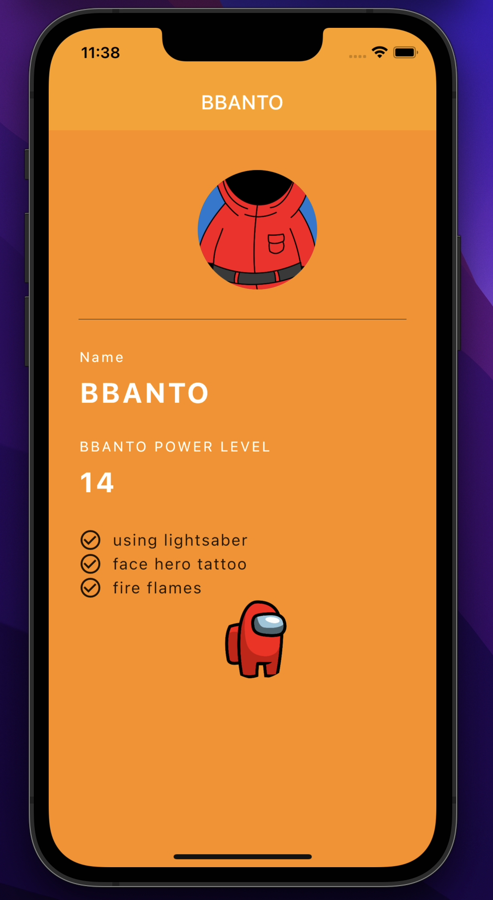
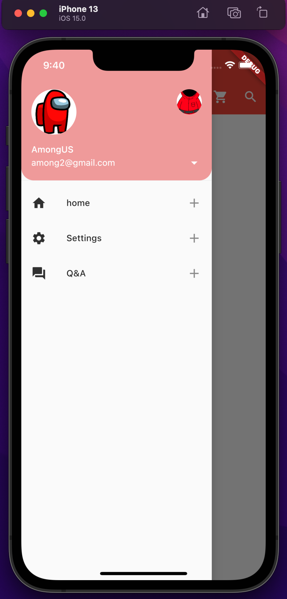
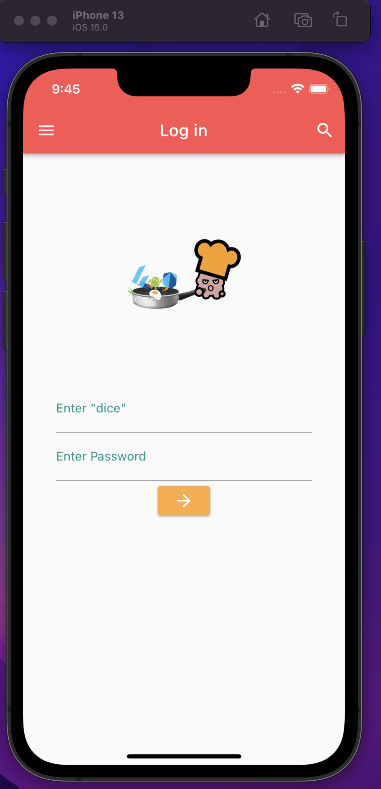
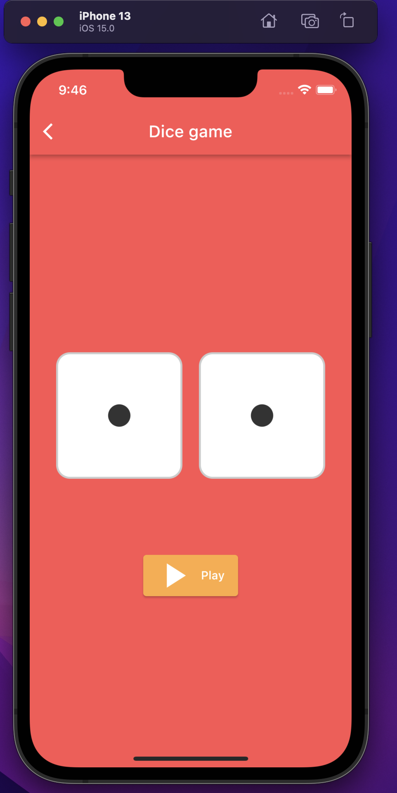

# 코딩셰프 동영상 따라하기 :)

[코딩셰프](https://www.youtube.com/channel/UC_2ge45JCuJH1z6VYt4iCgQ) 강좌 보고 따라하기.

- [start1](./start1): Flutter 가장 기본 
- [character app](./start2): 캐릭터 상세 정보

- [drawer app](./start3): drawer

- [login / dice app](./start5): login with dice
<table>
    <tr>
        <td></td>
        <td></td>
    </tr>
</table>